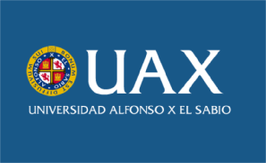

# Charla AeroPython Universidad Alfonso X el Sabio

## [Juan Luis Cano](http://es.linkedin.com/in/juanluiscanor) y [Álex Sáez](https://www.linkedin.com/in/alejandrosaezm)

__Charla de introducción a Python en la Universidad Alfonso X el Sabio__
__5 de diciembre de 2016__

Charla-taller introductorio a Python científico (NumPy, matplotlib y SciPy) dirigida a los alumnos de las asignaturas de Termodinámica (2º) y Motores (3º) del grado en Ingeniería Aeroespacial.

Impartido con la colaboración del Profesor [Marcos A. Rodríguez Jiménez](https://www.linkedin.com/in/marcos-antonio-rodr%C3%ADguez-jim%C3%A9nez-50615446).

 Curso AeroPython por Juan Luis Cano Rodriguez y Alejandro Sáez Mollejo se distribuye bajo una <a rel="license" href="http://creativecommons.org/licenses/by/4.0/deed.es">Licencia Creative Commons Atribución 4.0 Internacional</a>.
